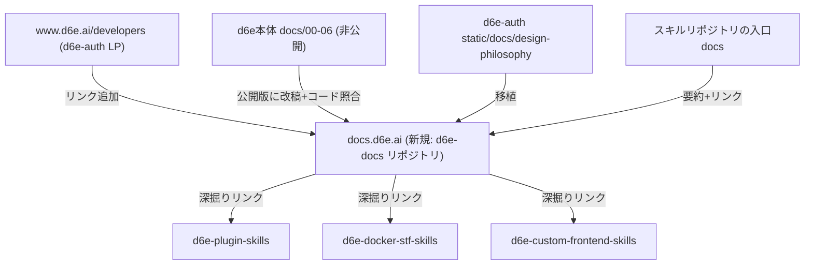

# 開発者向けドキュメントサイト (docs.d6e.ai) 新設計画

## 背景と目的

外部開発者向け情報が LP 1ページ + 3つのスキルリポジトリに分散しており、横断的な「全体像」を示すドキュメントが存在しない。専用 docs サイトを新設し、書き下ろしの俯瞰ガイド + 各リポジトリへの導線 + 公開 API/MCP リファレンスを提供する。スキルリポジトリは引き続き AI エージェント向けの正とし、docs サイトは人間の理解とナビゲーションに特化する。

## 全体構成

## 主要な技術決定

- 新規公開リポジトリ `d6e-ai/d6e-docs`(ローカル: `/home/user/github.com/d6e-ai/d6e-docs`)
- Astro Starlight を採用。理由: docs 特化(サイドバー/目次/ダークモード)、Pagefind 全文検索標準搭載、i18n が第一級サポート
- i18n は LP([d6e-auth/project.inlang/settings.json](d6e-auth/project.inlang/settings.json) の baseLocale=ja-JP)に合わせ、ルート=日本語、`/en/` =英語
- デプロイは Vercel(既存の d6e-auth と同じ)。カスタムドメイン `docs.d6e.ai` の DNS 設定はユーザー側作業として案内
- AI エージェント向けに `llms.txt` / raw Markdown 配信を用意(`starlight-llms-txt` プラグイン)。LP の raw MD 配信方針([d6e-auth/static/docs/](d6e-auth/static/docs/))と整合
- ブランディングは LP のロゴ・カラーを流用

## サイト構成(日英各ページ)

- はじめに
  - d6e とは(全体像): インスタンス / ワークスペース / d6e-auth / 公開 API の関係を図解。書き下ろし
  - アーキテクチャ: 信頼境界と構成図。[d6e-custom-frontend-skills/docs/frontend-and-instance.md](d6e-custom-frontend-skills/docs/frontend-and-instance.md) と [d6e/docs/00-overview.md](d6e/docs/00-overview.md) を元に再構成
  - 設計思想: [d6e-auth/static/docs/design-philosophy.md](d6e-auth/static/docs/design-philosophy.md)(.ja.md)を移植
  - 開発パスの選び方: コンソール → Plugin → Docker STF → カスタム FE の段階採用ナビ
- ガイド
  - ローカル AI 開発(MCP 接続): [d6e-plugin-skills/docs/local-ai-development.md](d6e-plugin-skills/docs/local-ai-development.md)(.ja.md)を要約移植し原典へリンク
  - Plugin 開発: 概要 + skills.sh インストールコマンド + d6e-plugin-skills へリンク
  - Docker STF 開発: 概要 + d6e-docker-stf-skills(QUICKSTART)へリンク
  - カスタムフロントエンド開発: 概要 + d6e-custom-frontend-skills へリンク
- コアコンセプト: [d6e/docs/02-core-concepts.md](d6e/docs/02-core-concepts.md) の公開版(内部実装への言及を除去し日英化)
- リファレンス
  - REST API: [d6e/docs/03-api-reference.md](d6e/docs/03-api-reference.md) を元に、現行コード(`d6e/packages/api` のルート定義)と照合して公開版を作成
  - MCP ツール: [d6e/docs/06-mcp-integration.md](d6e/docs/06-mcp-integration.md) を元に、`d6e/packages/mcp` のツール定義から一覧を再生成(約90ツール。2026-03 時点の文書のため要照合)

## d6e-auth の変更(小規模 PR)

- [d6e-auth/src/routes/developers/+page.svelte](d6e-auth/src/routes/developers/+page.svelte) に docs.d6e.ai への CTA/リンクを追加
- [d6e-auth/messages/ja-JP.json](d6e-auth/messages/ja-JP.json) / en-US.json に文言キー追加

## 進め方(ユーザールール準拠)

1. `d6e-docs` リポジトリ作成 → ブランチ上の `.plans/` に本プランを push → Issue 作成しコメントにリンク
2. 実装完了後、`Closes #N` 付きで PR 作成(d6e-docs 本体、d6e-auth の導線追加はそれぞれ別 PR)
3. デプロイ後にブラウザで表示確認(日英切替・検索・モバイル)

## スコープ外

- スキルリポジトリ側 docs の自動同期(今回は書き下ろし+リンク方式)
- ブログ、バージョニング、OpenAPI 自動生成