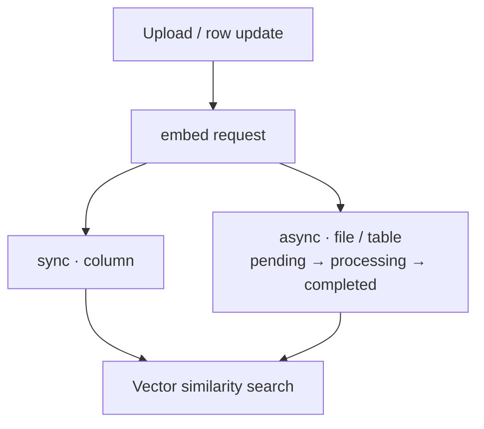

These are the units you work with when calling d6e via the public API, MCP, or a custom frontend. An **instance** hosts one or more **workspaces**; tables, policies, and workflows stay inside that boundary.

## Big picture

```
Workspace (top isolation unit)
├─ Tables (SQL + policies)
├─ Policies & Policy Groups
├─ Workflows
│   ├─ STF steps (compute)
│   └─ Effect steps (outbound HTTP)
├─ Files & Embeddings
└─ Members (admin / member)
```

The public API surface is `/api/v1/*` on the instance. See [REST API](/en-us/reference/rest-api/) for the full catalog.

---

## Workspace

A **workspace** is the top isolation unit. Tables, workflows, policies, and files are all workspace-scoped. You cannot see another workspace’s rows or definitions.

| Topic | Detail |
|---|---|
| Roles | `admin` / `member` |
| API keys | Bound to a **user**; access inherits that user’s memberships |
| DDL | Workspace **admin**, or subjects in the workspace’s **DDL policy group** |

Membership and invitations live under `/api/v1/workspaces/{id}/members`. An API key is not permanently pinned to one workspace — **what the key owner can reach** follows which workspaces that user belongs to.

---

## SQL

Run SQL directly against workspace tables:

```
POST /api/v1/workspaces/{id}/sql
Authorization: Bearer <token>
Content-Type: application/json

{ "sql": "SELECT * FROM invoices WHERE status = 'open'" }
```

### Logical names and physical prefix

Write **logical table names** (e.g. `invoices`). At execute time they are rewritten with a workspace prefix.

| Rule | Detail |
|---|---|
| Max logical name length | **23 characters** |
| Physical shape | `ws_{workspace_id}_` + logical name |
| Per request | **One statement only** |

```sql
-- What you write (logical name)
SELECT id, amount FROM invoices;

-- Rewritten at runtime (conceptual)
SELECT id, amount FROM …ws_<id>_invoices…;
```

### System columns

`CREATE TABLE` adds these system columns:

| Column | Role |
|---|---|
| `id` | Primary key (UUIDv7 recommended) |
| `created_at` | Created timestamp |
| `updated_at` | Updated timestamp |
| `deleted_at` | Soft-delete marker; `DELETE` becomes a soft delete |

There is also `POST …/sql/preview` for inspecting rewritten SQL. Preview does **not** evaluate runtime policies — authorization is decided on execute.

DDL (`CREATE` / `ALTER` / `DROP`, …) requires **admin** or membership in the workspace **DDL policy group**. Otherwise you get `DDL_FORBIDDEN`.

---

## Policy

Row- and operation-level access control. **Default is deny** — only explicitly allowed operations succeed.

Evaluation order, simplified:

1. Match a **deny** → reject
2. Else match an **allow** → permit
3. Else → reject (default deny)

```
Request (who × table × operation × rows)
        │
        ▼
   Matches deny? ──yes──► Reject (POLICY_DENIED)
        │ no
        ▼
   Matches allow? ──yes──► Allow
        │ no
        ▼
      Reject (default)
```

### Policy Group

Policies attach to a **Policy Group**, not a single user. A group can include:

| Field | Meaning |
|---|---|
| `user_ids` | Users in the group |
| `stf_ids` | STFs in the group (automation identities) |

Interactive calls evaluate as a **user**; workflow STF runs evaluate as an **STF**. You can grant a human UI one group and a batch STF another on the same table.

### Conditions

Policies may include a JSON **condition**. Only matching rows are covered by that allow/deny. Conditions are injected into SQL at runtime so the server still filters even if the client omits a `WHERE`.

Common `operation` values:

| operation | Applies to |
|---|---|
| `select` / `insert` / `update` / `delete` | SQL DML |
| `ddl` | Schema changes |
| `storage_read` / `storage_write` | Files |

A blocked execute returns `403` with `POLICY_DENIED` (distinct from auth membership failures).

---

## Workflow / STF / Effect

A **Workflow** is a named automation graph. The main step types:

| Step type | Role |
|---|---|
| **STF** | Compute, transform, business logic |
| **Effect** | Outbound HTTP (preset definitions) |

```
[Input]
   │
   ▼
[STF] ── aggregate / validate / reshape ──┐
   │                                      │
   ▼                                      ▼
[Effect] ── POST to webhook / SaaS API
   │
   ▼
[Output]
```

### STF (State Transition Function)

| Runtime | Typical use |
|---|---|
| JavaScript (QuickJS) | Light transforms and validation |
| Docker | Any language, heavier jobs, explicit dependencies |

To try an STF without composing a workflow, use **instant-run**:

```
POST /api/v1/stfs/instant-run
Authorization: Bearer <token>
X-Workspace-ID: <workspace-uuid>

{
  "stf_version_id": "<uuid>",
  "input": { "amount": 1200 }
}
```

See [Docker STF development](/en-us/guides/docker-stf/) for container contracts.

### Effect

An Effect is a reusable **HTTP call definition** (method, URL, headers, body mapping). Workflow Effect steps invoke it to send side effects to external APIs or webhooks.

---

## Auth

Call the public API with `Authorization: Bearer …`.

| Credential | Shape | Typical use |
|---|---|---|
| Session token | `ses_*` | Interactive login session |
| API key | `d6e_*` | Local AI agents, automation, server-to-server |
| JWT | Access token after OAuth exchange | Custom frontends |

Some endpoints do not take the workspace from the path alone and require:

```
X-Workspace-ID: <workspace-uuid>
```

Examples: workflow execute, STF / Effect routes, policy CRUD, some file operations.  
Path-scoped routes (SQL, members, …) resolve the workspace from `{id}` instead. A missing header often yields `400 Missing X-Workspace-ID`.

For the broader auth flow, see [Architecture](/en-us/getting-started/architecture/).

---

## Embeddings

Vector embeddings for semantic search. The instance owns the model path (Gemini-family models + pgvector) — custom apps do not need provider API keys.

| Surface | Target | Completion |
|---|---|---|
| **Column** | Text column on a SQL table | **Synchronous** (generate waits) |
| **File** | Uploaded storage files | **Async** (poll status) |
| **Table row** | Row JSON across tables | **Async** (poll status) |



<details>
<summary>Text version (ASCII)</summary>

```
Upload / row update
        │
        ▼
  embed request
        │
   ┌────┴────┐
   │ sync    │ async (file / table)
   │ column  │  → pending → processing → completed
   └────┬────┘
        ▼
   Vector similarity search
```

</details>

Do not search file/table embeddings until status is `completed`. For columns, use the generate response counts to confirm completion.

---

## Related links

- [REST API](/en-us/reference/rest-api/)
- [MCP tools](/en-us/reference/mcp-tools/)
- [Architecture](/en-us/getting-started/architecture/)
- [Design philosophy](/en-us/getting-started/design-philosophy/)
- [Docker STF development](/en-us/guides/docker-stf/)
- [Custom frontend](/en-us/guides/custom-frontend/)
- [Local AI development](/en-us/guides/local-ai-development/)
