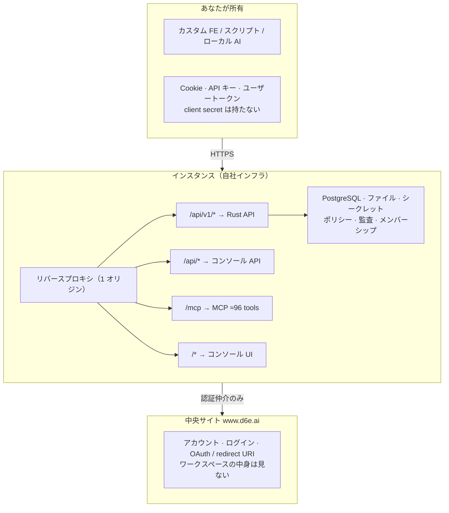

d6e の境界はシンプルです。**ワークスペースのデータと AI 実行はインスタンス側**、**アカウントと OAuth 登録は中央サイト側**、**UI や独自バックエンドはあなたの側**に置きます。

## 信頼境界



<details>
<summary>テキスト版（ASCII）</summary>

```
┌─ あなたが所有 ──────────────────────────────────────────────┐
│  カスタム FE / スクリプト / ローカル AI エージェント         │
│  ・セッション Cookie（FE）                                   │
│  ・API キー（d6e_…）またはユーザートークン                   │
│  ・client secret は持たない（OAuth はインスタンスが仲介）   │
└───────────────────────────────┬─────────────────────────────┘
                                │ HTTPS
┌─ インスタンス（自社インフラ）─┴─────────────────────────────┐
│  リバースプロキシ（1 オリジン）                              │
│   ├─ /api/v1/*     → Rust API（SQL / STF / files / SaaS…）  │
│   ├─ /api/*        → コンソール側 API（チャット等）         │
│   ├─ /mcp (:8081)  → MCP サーバー（≈96 d6e_* ツール）       │
│   └─ /*            → コンソール UI                          │
│  PostgreSQL（user_data） / ファイルストレージ / 暗号化シークレット │
│  ポリシー強制・監査ログ・メンバーシップ                      │
└─────────────────────────────────────────────────────────────┘
                                │ 認証仲介のみ
┌─ 中央サイト www.d6e.ai ─────────────────────────────────────┐
│  アカウント・ログイン・OAuth クライアント / redirect URI     │
│  ワークスペースの中身は見ない                                │
└─────────────────────────────────────────────────────────────┘
```

</details>

## インスタンスの 2 つの API 面

1 つの `D6E_BASE_URL` オリジンが、パスで振り分けられた 2 つの API 面を提供します。

| パス | 実装 | 主な用途 |
|---|---|---|
| `/api/v1/*` | Rust (Axum) | SQL、ファイル、STF、ワークフロー、ポリシー、SaaS プロキシ、埋め込み検索 |
| `/api/*`（v1 以外） | コンソール (SvelteKit) | チャットセッション、`execute-by-intent` など UI 向け |

外部から見るときは **1 ホスト**です。カスタムフロントエンドもローカル AI エージェントも、同じホストに向けます。

## 認証の骨格

1. ブラウザを `https://www.d6e.ai/auth/login` へリダイレクト（`redirect_uri` 付き）
2. 認可コードを**インスタンスの** `POST /api/v1/auth/token` に渡す
3. インスタンスが中央サイトへ中継し、インスタンス audience のトークンペアを返す
4. 以降は `Authorization: Bearer …`（＋必要なら `X-Workspace-ID`）で `/api/v1/*` を呼ぶ

フロントエンドは **client secret を保持しません**。デプロイ後の callback URL は d6e-auth（フランチャイズポータルまたはワークスペース設定）に登録します。ループバック/`localhost` は登録不要です。

ローカル開発ではコンソールから発行した **API キー (`d6e_…`)** を使うのが最短です。

## Plugin とカスタムフロントエンド

| | Plugin | カスタムフロントエンド |
|---|---|---|
| 実体 | ワークスペースの中身（プロンプト・STF・WF・ファイル）を詰めた `template.yaml` | ワークスペースを*利用する*独立 Web アプリ |
| 存在する場所 | インスタンスの**中** | インスタンスの**外** |
| UI | コンソール / チャット経由 | それ自体が UI |

両者は同じ API 境界の反対側から拡張し、自然に組み合わせられます。詳細は [カスタムフロントエンド](/ja-jp/guides/custom-frontend/) と [Plugin 開発](/ja-jp/guides/plugins/) を参照してください。

## 関連資料（原典）

- [カスタムフロントエンドとインスタンスの関係（日）](https://github.com/d6e-ai/d6e-custom-frontend-skills/blob/main/docs/frontend-and-instance.ja.md)
- [ローカル AI エージェント開発ガイド（日）](https://github.com/d6e-ai/d6e-plugin-skills/blob/main/docs/local-ai-development.ja.md)
