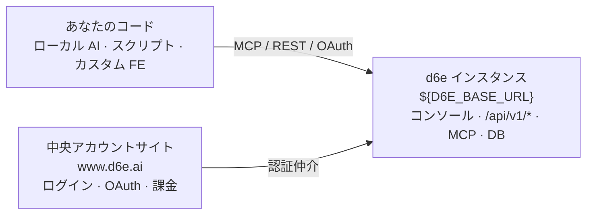

d6e は**セルフホスト可能な AI ワークプラットフォーム**です。インスタンスを自社環境（オンプレミスまたはプライベートクラウド）にデプロイし、その中でワークスペースをホストします。AI エージェントはチャットコンソール、MCP、または REST API 経由で同じ能力を使います。

## 3 つの登場人物



<details>
<summary>テキスト版（ASCII）</summary>

```
┌────────────────────────────────┐
│ あなたのコード                 │
│ ・ローカル AI エージェント     │
│ ・スクリプト / バックエンド    │
│ ・カスタムフロントエンド       │
└───────────┬────────────────────┘
            │ MCP / REST / OAuth
            ▼
┌────────────────────────────────┐     ┌──────────────────────────┐
│ d6e インスタンス               │     │ 中央アカウントサイト     │
│ ${D6E_BASE_URL}                │◄────│ https://www.d6e.ai       │
│ ・コンソール (SvelteKit)       │認証  │ ・アカウント / ログイン  │
│ ・Rust API /api/v1/*           │仲介  │ ・OAuth クライアント登録 │
│ ・MCP :8081/mcp                │     │ ・課金 / フランチャイズ  │
│ ・PostgreSQL / ファイル        │     └──────────────────────────┘
│ ・STF・ワークフロー・SaaS      │
└────────────────────────────────┘
```

</details>

| 登場人物 | 役割 | データの所在 |
|---|---|---|
| **d6e インスタンス** | ワークスペースをホストする。SQL・ファイル・STF・ワークフロー・SaaS 認証情報・チャットを提供 | **自社インフラ** |
| **中央アカウントサイト** ([www.d6e.ai](https://www.d6e.ai)) | アカウント・ログイン・OAuth クライアント / redirect URI 登録・課金 | アカウント情報のみ。ワークスペースデータは持たない |
| **あなたのコード** | ローカル AI エージェント、スクリプト、カスタム FE | あなたのホスティング |

## ワークスペースに束ねられているもの

- PostgreSQL ベースのワークスペース DB（`user_data` スキーマ）
- ファイルストレージ（アップロード、生成レポート、Google Drive 同期）
- STF（State Transition Function — ビジネスロジック）
- ワークフローとスケジュール
- SaaS 認証情報（freee、Money Forward、Google Workspace、Salesforce、Notion、Box、GitHub、Chatwork、Zendesk など）
- AI エージェントが上記を操作するチャットコンソール

## 「すべてが公開 API」の意味

コンソールも内蔵チャットエージェントも、**あなたが API キーや MCP で呼べるのと同じ面**の上に乗っています。特権的な内部 API はありません。

| 面 | 用途 |
|---|---|
| REST `/api/v1/*` | スクリプト・バックエンド・カスタム FE から直接呼ぶ |
| MCP `d6e_*`（約 96 ツール） | ローカル AI エージェント / 内蔵チャットと同じツール一式 |
| コンソール | 上記 REST / MCP のクライアントとして動く Web UI |

## 次に読むページ

- [アーキテクチャ](/ja-jp/getting-started/architecture/) — 信頼境界と構成図
- [設計思想](/ja-jp/getting-started/design-philosophy/) — 疎結合の原則
- [開発パスの選び方](/ja-jp/getting-started/choosing-a-path/) — コンソール / Plugin / Docker STF / カスタム FE
- [ローカル AI 開発](/ja-jp/guides/local-ai-development/) — MCP 接続の最短手順
